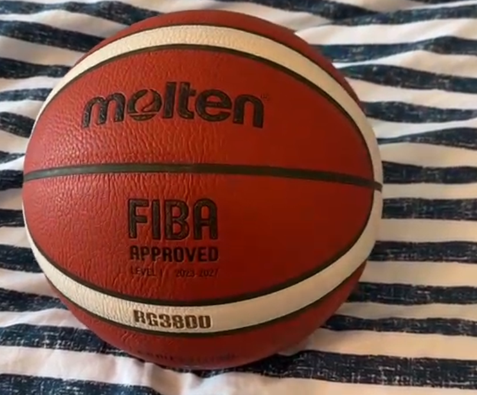
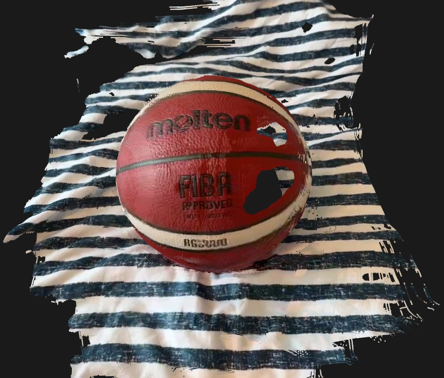

# From Video to 3D Reconstruction

**Reconstruct a 3D scene from a phone video**

Built on [AMB3R](https://github.com/HengyiWang/amb3r) (CVPR 2026) — a feed-forward metric-scale 3D reconstruction model from UCL. 

```
phone video  ->  frame extraction  ->  AMB3R reconstruction  ->  scene.ply + transforms.json
```
---

## Example Outputs
 
| Input Video | Viewer |
|---|---|
|  | |

---
 
## Design Choices
 
**Docker:** the entire environment (CUDA, PyTorch, all dependencies) is containerised. Users only need Docker and NVIDIA drivers. No conda, no pip conflicts, no manual CUDA setup.
 
**AMB3R over COLMAP:** COLMAP was my first option, however it takes a lot of time doing the feature matching process and minimizing the reprojection error. On the other hand, AMB3R is feed-forward inference in a single pass. No iterative optimisation, no feature matching pipeline, no calibration required. My main limitation right now is the hardware. With only 8GB of RAM on my GPU I cannot process large videos. 
 
**Two outputs by default** — a filtered `.ply` for immediate inspection and an unfiltered `.ply` for re-thresholding without re-running the model. Camera poses are exported in Nerfstudio format so the pipeline can be extended to 3D Gaussian Splatting without changes.
 
All of the design choices were primarly focused on speed and ease of use. The user only has to run a command on the terminal with the path to the video, and receives a visualization of the 3D rendering. 
---

## System Requirements

| Requirement | Minimum | Notes |
|---|---|---|
| **OS** | Ubuntu 20.04+ or Windows WSL2 | macOS not supported (no NVIDIA GPU) |
| **GPU** | NVIDIA with 8 GB+ VRAM | Tested on RTX 5070, 8gb|
| **NVIDIA Driver** | 520+ | Check with `nvidia-smi`|
| **Docker** | 20.10+ | Check with `docker --version` |
| **NVIDIA Container Toolkit** | Any recent | Lets Docker access your GPU. See Step 2 below. |
| **RAM** | 16 GB+ | |
| **Disk** | ~12 GB | ~10 GB Docker image + ~1 GB model weights |
---

## Setup (one-time)

### Step 1 — Install Docker

Follow the official guide: [docs.docker.com/engine/install](https://docs.docker.com/engine/install/ubuntu/)

Verify:
```bash
docker --version   # should print Docker version 20.10 or newer
```

### Step 2 — Install NVIDIA Container Toolkit

```bash
# Add the repository
curl -fsSL https://nvidia.github.io/libnvidia-container/gpgkey | sudo gpg --dearmor -o /usr/share/keyrings/nvidia-container-toolkit-keyring.gpg \
  && curl -s -L https://nvidia.github.io/libnvidia-container/stable/deb/nvidia-container-toolkit.list | \
    sed 's#deb https://#deb [signed-by=/usr/share/keyrings/nvidia-container-toolkit-keyring.gpg] https://#g' | \
    sudo tee /etc/apt/sources.list.d/nvidia-container-toolkit.list

# Install
sudo apt-get update && sudo apt-get install -y nvidia-container-toolkit

# Configure Docker and restart
sudo nvidia-ctk runtime configure --runtime=docker
sudo systemctl restart docker
```

Verify:
```bash
docker run --rm --gpus all nvidia/cuda:11.8.0-base-ubuntu22.04 nvidia-smi
# Should print your GPU info inside the container
```

### Step 3 — Clone the repo

```bash
git clone https://github.com/JacoboT27/PerceptionandSpatialAI.git
cd PerceptionandSpatialAI
```

### Step 4 — Pull the Docker image

> This downloads the pre-built image (~5–8 GB) from GitHub Container Registry. Takes 2–5 minutes depending on your connection. No compilation required.

```bash
docker compose pull
```

> **Alternatively**, if you'd prefer to build the image yourself from source:
> ```bash
> docker compose build
> ```
> Note: building from source takes **10–20 minutes** due to CUDA package compilation.

### Step 5 — Download model weights

```bash
docker compose run --rm app bash checkpoints/download_weights.sh
```

This downloads `amb3r.pt` (~1 GB) into `checkpoints/`. Only needed once.

---

## Usage

### Step 6 — Run the pipeline

Drop your video into the `inputs/` folder:
```
PerceptionandSpatialAI
├── checkpoints
├── examples
├── inputs
├── outputs
├── pipeline
├── .gitignore
├── docker-compose.yml
├── Dockerfile
├── README.md
└── run.py
```
run this once to give display acces to docker: 
``` 
xhost +local:docker
```

then run:

```bash
docker compose run --rm -e DISPLAY=$DISPLAY -v /tmp/.X11-unix:/tmp/.X11-unix app python run.py --video inputs/myvideo.mp4 --max_frames 18

```

Results appear in `outputs/myvideo/`:
```
outputs/myvideo/
├── scene.ply             ← filtered point cloud  (open in MeshLab / CloudCompare)
├── scene_unfiltered.ply  ← full point cloud (re-threshold without re-running)
├── transforms.json       ← camera poses in Nerfstudio format (for 3DGS)
└── frames/               ← extracted video frames
```

### Options

```
--video        Path to input video (required)
--output       Custom output directory  (default: outputs/<video_name>/)
--fps          Frame extraction rate    (default: 2.0  | recommended: 1–5)
--max_frames   Max frames to use        (default: 150  | on 8gb gpu max value before OOM ~18)
--conf         Confidence threshold     (default: 0.5  | range: 0.0–1.0)
--device       cuda or cpu              (default: cuda)
--checkpoint   Path to weights file     (default: checkpoints/amb3r.pt)
```

---

### Camera poses (transforms.json)
The `transforms.json` is in [Nerfstudio](https://docs.nerf.studio/) format. You can use it directly to run 3D Gaussian Splatting:

---

## How It Works

```
Video
  │
  ▼
extract_frames.py    — ffmpeg samples the video at --fps frames/sec
  │
  ▼
reconstruct.py       — AMB3R transformer predicts per-frame 3D pointmaps
  │                    and camera-to-world poses in a single forward pass.
  │                    No camera calibration or COLMAP needed.
  ▼
export.py            — Filters points by confidence, writes .ply and transforms.json
```

AMB3R is a feed-forward model: it processes the entire video in one pass without any scene-specific optimisation. This makes it fast but means very long videos or very large scenes may have accumulated drift. For best results, keep videos under ~3 minutes and walk the scene slowly and steadily.

---

## Tips for Good Reconstructions

- **Move slowly** — fast motion causes blur and hurts feature matching
- **Overlap** — walk back over areas you've filmed to improve consistency  
- **Lighting** — even, diffuse lighting works best. Avoid harsh shadows or reflective surfaces
- **Video length** — 30 seconds to 2 minutes is the sweet spot at 2 fps
- **Scene size** — AMB3R works best on room-scale or object-scale scenes

---

## Troubleshooting

### `no known GPU vendor found` when running Docker
The NVIDIA Container Toolkit is not installed. This is the bridge between Docker and your GPU — without it, Docker cannot see your GPU at all.

```bash
# 1. Add the NVIDIA Container Toolkit repository
curl -fsSL https://nvidia.github.io/libnvidia-container/gpgkey | sudo gpg --dearmor -o /usr/share/keyrings/nvidia-container-toolkit-keyring.gpg \
  && curl -s -L https://nvidia.github.io/libnvidia-container/stable/deb/nvidia-container-toolkit.list | \
    sed 's#deb https://#deb [signed-by=/usr/share/keyrings/nvidia-container-toolkit-keyring.gpg] https://#g' | \
    sudo tee /etc/apt/sources.list.d/nvidia-container-toolkit.list

# 2. Install it
sudo apt-get update && sudo apt-get install -y nvidia-container-toolkit

# 3. Configure Docker to use it
sudo nvidia-ctk runtime configure --runtime=docker
sudo systemctl restart docker
```

Then verify it works:
```bash
docker run --rm --gpus all nvidia/cuda:11.8.0-base-ubuntu22.04 nvidia-smi
# Should print your GPU info inside the container
```

---

### Building from source fails
If you chose to build from source instead of pulling the pre-built image:
- Make sure your NVIDIA driver is up to date (`nvidia-smi` should show driver 520+)
- Try rebuilding with `docker compose build --no-cache`
- Open an issue with the full error output and your GPU model

---

### Out of memory (OOM) during reconstruction
Reduce the number of frames fed to AMB3R:
```bash
python run.py --video inputs/myvideo.mp4 --max_frames 50 --fps 1
```

---

### Checkpoint not found
Run the download script before your first inference:
```bash
docker compose run --rm app bash checkpoints/download_weights.sh
```
If the Google Drive download fails, download `amb3r.pt` manually from the [AMB3R releases](https://drive.google.com/file/d/14x0WW2rUE_he2hUEouP6ywSRnlJDeLel/view) and place it at `checkpoints/amb3r.pt`.

---

### Point cloud looks sparse or noisy
Try lowering the confidence threshold:
```bash
python run.py --video inputs/myvideo.mp4 --conf 0.3
```
The unfiltered point cloud (`scene_unfiltered.ply`) is always saved alongside — you can re-threshold it in MeshLab without re-running the pipeline.

---


## Citation

The original AMB3R paper:

```bibtex
@article{wang2025amb3r,
  title={AMB3R: Accurate Feed-forward Metric-scale 3D Reconstruction with Backend},
  author={Wang, Hengyi and Agapito, Lourdes},
  journal={arXiv preprint arXiv:2511.20343},
  year={2025}
}
```

---

## License

This project wraps AMB3R, which is released under its own license. Please refer to the [AMB3R repository](https://github.com/HengyiWang/amb3r) for details.